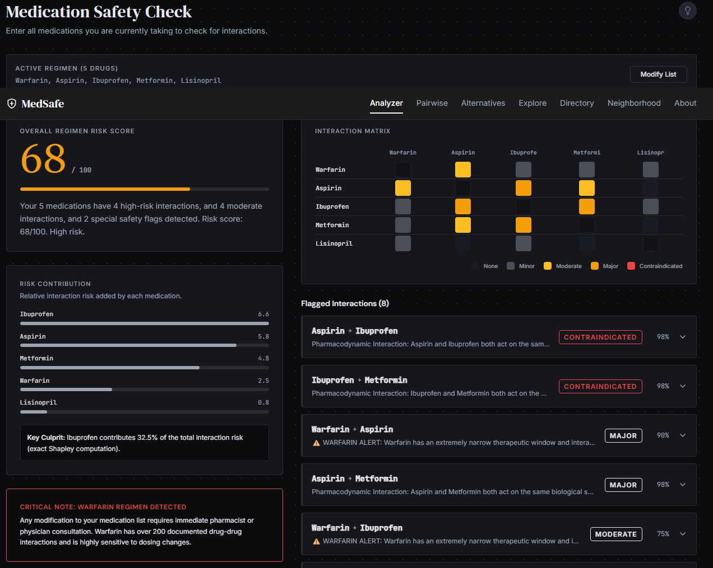
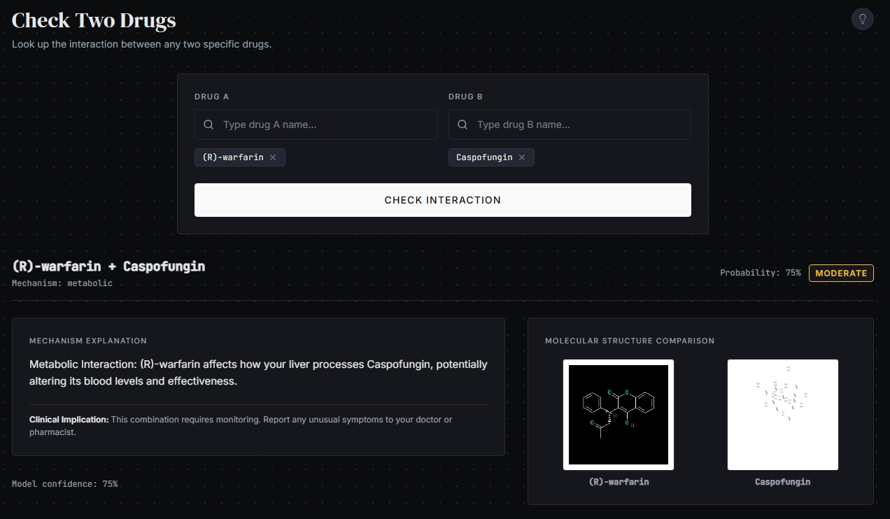
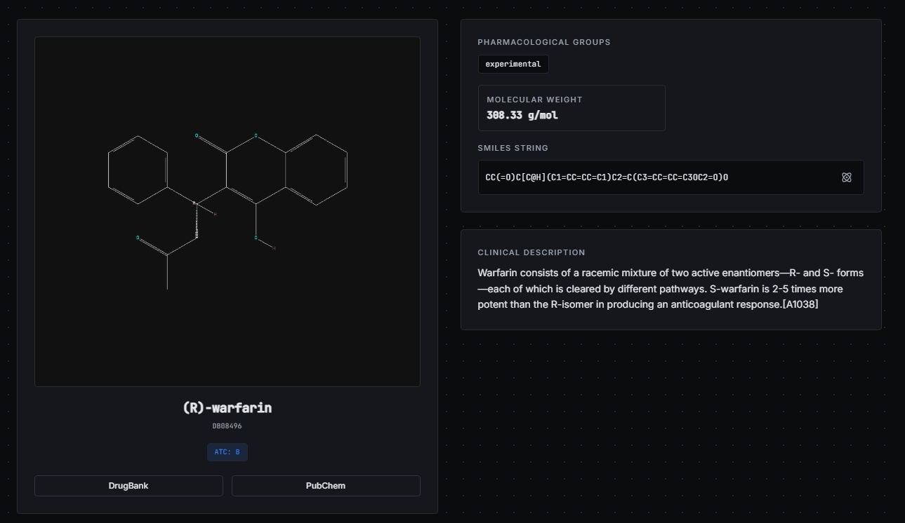
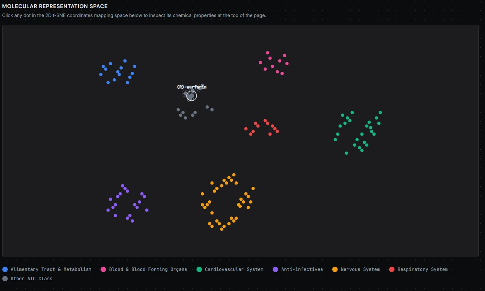

<table>
<tr>
<td align="center">
 
<b>Home Dashboard Analysis</b> 
 Multiple drug compatibility checking And anomaly detection 
</td>

<td align="center">
 
<b>Two drugs compatiblity check </b> 
You can check the compatiblity of two drugs
</td>
</tr>

<tr>
<td align="center">
 
<b>Drug Directory</b> 
Brief description of any drug that is in the directory .
</td>

<td align="center">
 
<b> Molecular representation space </b> 
Representation of molecules and their cluster similarities.
</td>
</tr>
</table>
